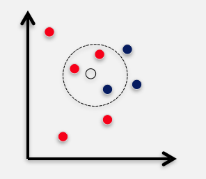

# Classification

> Features and Methods

### Feature candidate

* Adjacent words(collocations): chocolate bar, bar exam..
* Adjacent parts of speech
* Position: plant pesticide vs. pesticide plant
* Neighbor words: ex. within 10 words
* Topic of the text
* ...

### Method candidate

* #### K-nearest neighbor

    - Using **Euclidean distance**, find the **k most similar examples** and return **the majority class for them**.

* #### Bootstrapping

    - Start with two senses and seeds for each sense
    
        ex. $$plant_{1} \rightarrow leaf$$, $$plant_{2} \rightarrow factory$$
        
    - Use these seeds to label the data using a **supervised classifier (decision list)**
    
    - Add newly labled examples to the training data
    
    - Terminate when no more examples can be labled.