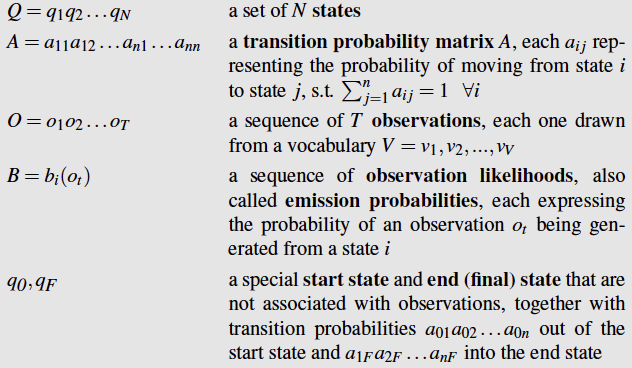

# Defintion of Hidden Markov Model

### Observed Events vs. Hidden Events

* We can compute probability of a sequence of **observed events**
* Sometimes the events we are interested in may not be directly observable in the world $$\rightarrow$$ hidden events.

### What is the goal of HMM?

> Given a sequence of **observed events**, compute the probability of different sequence of **hidden events**, the provide the **most probable** sequence of **hidden events**

#### An Ice Cream Example

Imagine you are a climatologist in the year 2799 studying the history of global warming. You cannot find any records of the weather in Baltimore, Maryland, for the summer of 2007, but you do find Jason Eisner’s diary, which lists how many ice creams Jason ate every day that summer. Our goal is to use these observations to estimate the temperature every day. We’ll simplify this weather task by assuming there are only two kinds of days: cold (C) and hot (H). So the Eisner task is as follows:

> Given a sequence of observations **O**, each observation an integer corresponding to the number of ice creams eaten on a given day, figure out the correct ‘hidden’ sequence Q of weather states (H or C) which caused Jason to eat the ice cream.

### Formal Definition of HMM

