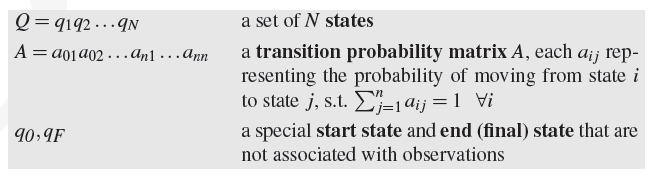

# Hidden Markov Model (HMM)

> HMM is a **sequence mode**. A sequence model assigns a label to **each unit in a sequence**.

> HMM is a **probablistic sequence model** - compute a probability distribution over **possible sequences** of labels, and choose the **best label sequence**.

### Probabilistic Graphical Model

HMM is a **Markov chain**, **Markov chain** is a **probablistic graphical model**. A markov chain has the following components:

