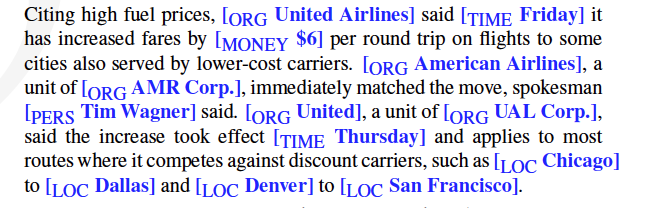
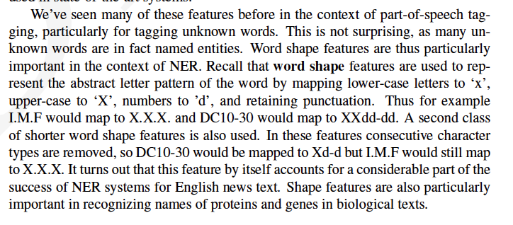

# Information Extraction

## Reading Notes

### Temporal expressions:
Figure out **when** the events in a text happened.

Sensentence with dates $$\rightarrow$$ dates in database

### Named Entity Recoginition (NER)

Detec **entities** in the text. 

**NER** can be a word-by-word sequence labeling task.

#### Word Shape

#### Eval of NER
- Recall and Precision, as usual.

### 18.2 Relation Extraction
