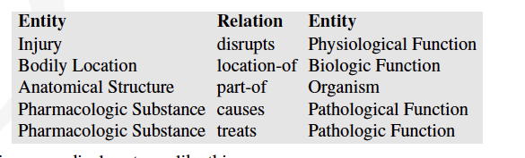
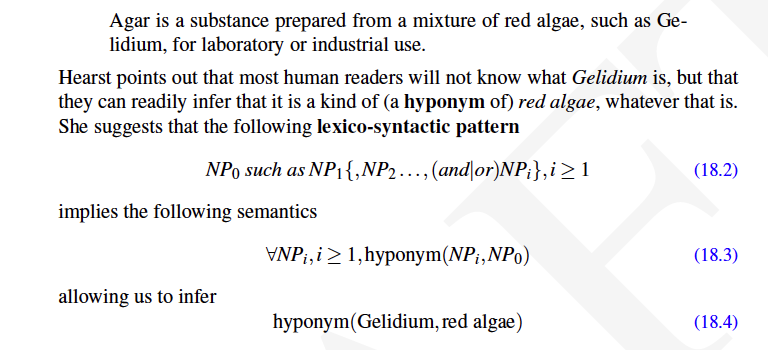

# Reading Notes: Chapter 18 Information Extraction 

### Temporal expressions:
Figure out **when** the events in a text happened.

Sensentence with dates $$\rightarrow$$ dates in database

### Named Entity Recoginition (NER)

Detec **entities** in the text. 

**NER** can be a word-by-word sequence labeling task.

#### Word Shape

#### Eval of NER
- Recall and Precision, as usual.

## Relation Extraction

Given we identified entities, how to identify **relationships** among the entities.

### Entity, Relation, Entity

Most naive model - we can form ordered tuples among entities involved.

#### IS-A hypernym
Is-A is an "instance-of" type of relation between individuals and classes.

### Supervised Learning
1. Lexico-syntactic patterns
Consider the following example:

> Assuming we have a large collection of previously annotated material using many lexico-syntactic patterns, then we can train a classifier.

### Semisupervised Learning: 

> Use smaller training set, but enough to **bootstrap** a classifier!

**Bootstrapping** proceeds by taking the entities in the seed pair, and then finding sentences (on the web, or whatever dataset we are using) that contain both entities. From all such sentences, we extract and generalize the context around the entities to learn new patterns.

Bootstrapping systems also assign a confidence values to new tuples to avoid semantic drift. In semantic drift, and erroneous pattern leads to the introduction of erroneous tuples, which, in turn, lead to the creation of problematic patterns and the meaning of the extracted relations 'drifts'.

